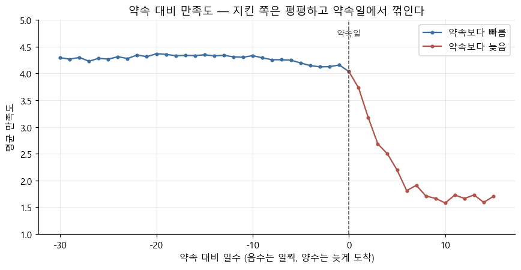
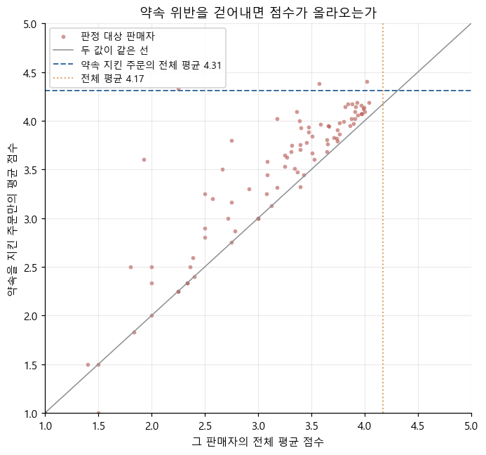

# Olist E-commerce 데이터 분석 프로젝트

브라질 이커머스 플랫폼 [Olist](https://www.kaggle.com/datasets/olistbr/brazilian-ecommerce)의 공개 데이터셋을 활용한
데이터 분석가(Data Analyst) 취업 준비용 SQL/DB 프로젝트입니다.

## 프로젝트 목표
- 실제 서비스에 가까운 다중 테이블 관계형 데이터를 다뤄보며 SQL 분석 역량 강화
- 비즈니스 질문 정의 → SQL 쿼리 작성 → 인사이트 도출 → 시각화까지 전 과정 경험
- 포트폴리오로 활용 가능한 분석 리포트 작성

## 검증할 가설

| # | 가설 | 상태 |
|---|---|---|
| 1 | 만족스러운 배송 시간의 기준은 지역마다 다르고, 같은 소요 일수라도 지역에 따라 고객 만족도가 다르게 나타난다 | 검증 완료 |
| 2 | 고객 만족은 얼마나 기다렸는가가 아니라 주문 시점에 제시된 약속(예상 도착일)이 지켜졌는가에 영향을 받는다 | 검증 완료 |
| 3 | 지속적으로 낮은 평가를 받는 판매자가 실재하며, 그 낮은 평가가 약속 위반에서 오는지 아닌지에 따라 처방이 달라진다 | 검증 완료 |

### 가설 1 의 전제

1. 지역마다 배송에 걸리는 시간이 다르다. 빠른 지역이 있고 오래 걸리는 지역이 있다
2. 고객도 자기 지역의 배송 속도를 어느 정도 알고 있다

"배송이 느리면 만족도가 낮다"는 결과가 뻔하지만, 기준선이 지역마다 다른지는 확인해야 알 수 있습니다.
20 일이 걸린 주문은 중앙값이 26 일인 주에서는 빠른 편이고 7 일인 주에서는 세 배 늦은 것입니다.

기대치의 후보는 둘입니다. **그 지역의 통상 소요 시간**, 그리고 주문할 때 플랫폼이 제시한
**예상 도착일**. 어느 쪽이 고객 만족도를 더 잘 설명하는지를 함께 봅니다.

### 가설 2 는 가설 1 을 검증하다 나왔습니다

기대치의 후보 둘을 견주는 과정에서 예상 도착일 쪽이 기준선을 대리한다는 것이 드러났습니다.
가설 1 과 같은 표본·같은 지표를 쓰고 검증 과정이 이어져 있어
`06` 한 노트북에서 함께 다룹니다.

데이터를 보며 새로 떠오르는 가설을 이 목록에 추가해 나갑니다.
표본은 가설마다 다르므로 품질 점검 노트북에서 확정하지 않고, 가설을 정할 때 함께 정의합니다.

## 데이터셋
- 출처: [Kaggle - Brazilian E-Commerce Public Dataset by Olist](https://www.kaggle.com/datasets/olistbr/brazilian-ecommerce)
- 원본 CSV 파일은 용량 문제로 저장소에 포함하지 않았습니다. 위 링크에서 다운로드 후
  `archive/` 폴더에 압축을 풀어 사용하세요.
- 구성 (9개 테이블): 고객(customers), 주문(orders), 주문 상세(order_items),
  결제(order_payments), 리뷰(order_reviews), 상품(products), 판매자(sellers),
  지리정보(geolocation), 카테고리명 번역(product_category_name_translation)

## 사용 기술
- **DuckDB**: 로컬 SQL 분석 엔진 (설치 부담 없이 빠르게 시작)
- **SQL**: 모든 집계와 검증은 SQL로 수행하며 pandas로 우회하지 않습니다
- **Python**: 노트북 실행과 시각화

## 노트북

| 노트북 | 내용 |
|---|---|
| [`01_data_exploration`](notebooks/01_data_exploration.ipynb) | 원본 CSV 9개의 컬럼·타입·행 수와 샘플 데이터 확인 |
| [`02_load_tables`](notebooks/02_load_tables.ipynb) | CSV를 DuckDB 파일에 영구 테이블로 적재하고 원본과 행 수 대조 |
| [`03_data_quality`](notebooks/03_data_quality.ipynb) | 테이블 구조와 관계 점검 — 그레인·키 확정, 참조 무결성, 카디널리티, 중복 |
| [`04_missing_and_validity`](notebooks/04_missing_and_validity.ipynb) | 값 점검 — 결측의 규모와 성격, 시각 순서, 값의 도메인 |
| [`05_metrics_and_sample`](notebooks/05_metrics_and_sample.ipynb) | 분석 기반 — 만족의 척도, 공용 표본, 중복 리뷰 축약 규칙, 파생 지표 |
| [`06_delivery_expectation`](notebooks/06_delivery_expectation.ipynb) | 가설 1 · 2 검증 — 배송 시간과 약속, 그리고 고객 만족도 |
| [`07_seller_quality`](notebooks/07_seller_quality.ipynb) | 가설 3 검증 — 판매자에 따라 갈리는 만족과 그 처방 |

### 03에서 확인한 것

조인해서 집계해도 결과가 틀어지지 않는지를 데이터로 확인했습니다.
컬럼 설명과 ERD는 후보를 세우는 데만 참고하고, 확정은 전부 쿼리 결과로 판단했습니다.

- `order_items` 에는 수량 컬럼이 없습니다. 같은 상품을 여러 개 사면 행이 그 개수만큼
  생기므로, 주문 수량은 `COUNT(*)`, 상품 금액은 `SUM(price)` 로 구해야 합니다.
- 한 주문에 리뷰가 2건 이상 달린 경우가 547건 있습니다. `orders` 에 그대로 조인하면
  리뷰가 달린 주문 98,673건이 99,224행으로 늘어납니다.
- 품목 기록이 없는 주문 775건은 배송된 것이 하나도 없습니다.
  결제까지 마쳤으나 상품을 확보하지 못해 무산된 주문이며, 그중 756건에는 리뷰가 달려 있습니다.
- 같은 도시명이 서로 다른 주에 존재합니다. 도시 4,119개에 `(도시, 주)` 조합은 4,310개이므로,
  도시 단위 집계는 반드시 주와 함께 묶어야 합니다.
- `geolocation` 은 자연 키가 없고 완전 중복 행이 26만 건입니다. 이 프로젝트는 좌표·거리를
  다루지 않고 주·도시는 `customers`·`sellers` 가 자체 보유하므로 사용하지 않습니다.
- 운임은 주문당 한 번이 아니라 행마다 붙는 값입니다. 결제액과 대조해 판정했는데,
  복수 품목 주문 9,802건에서 `SUM` 은 9,651건이 맞고 `MAX` 는 39건만 맞았습니다.
- 자식에서 부모를 찾는 참조는 5개 관계 모두 짝이 없는 행이 0건입니다. 짝이 없던 것은
  주문에 품목·결제·리뷰가 없는 반대 방향뿐이며, 이는 취소된 주문 등에서 자연스럽게 생깁니다.

### 04에서 확인한 것

값이 비어 있는지, 비어 있다면 그것이 결함인지 아직 일어나지 않은 사건인지 가렸습니다.
표본은 가설마다 달라지므로 여기서 확정하지 않고, 조건별로 빠지는 행의 규모만 남겼습니다.

- 결측이 있는 테이블은 9개 중 3개뿐입니다. 리뷰 제목 88%, 본문 59%가 비어 있으나
  빈 문자열이 11건뿐이라 값의 유실이 아니라 선택 입력을 하지 않은 것입니다. 리뷰 점수는 결측이 0입니다.
- 배송 완료일 결측 2,965건은 대부분 주문 상태로 설명됩니다. `shipped` 는 아직 도착 전이고
  `unavailable`·`invoiced` 는 출고조차 안 된 주문이라, 결측이 아니라 아직 일어나지 않은 사건입니다.
- 상태와 어긋나는 것은 `delivered` 인데 완료일이 없는 8건입니다. 리뷰 본문을 읽어보니
  "예정일보다 일찍 도착했다" 같은 내용이라 배송은 실제로 되었고 시각만 기록되지 않았습니다.
- `shipped` 1,107건은 수집 종료 무렵이 아니라 전 기간에 퍼져 있습니다. 2018-03이 133건으로
  가장 많아 "아직 배송 중"으로 볼 수 없습니다.
- 구매와 수령의 시각 역전은 0건이라 배송 소요 시간 계산은 안전합니다. 중간 시각은 1,373건이
  어긋나 있어 구간을 나눠 계산할 때만 걸립니다.
- 데이터셋 양 끝이 잘려 있습니다. 온전한 구간은 2017-01 ~ 2018-08이며 그 밖은 349건(0.35%)입니다.

### 05에서 정한 것

가설마다 기준을 따로 정하면 노트북끼리 표본이 어긋나므로, 모든 가설이 함께 쓸 기준을 한곳에 모았습니다.
가설이 늘어나면서 공용으로 필요해진 것이 생기면 이 노트북에 추가합니다.

- **고객 만족은 리뷰 점수(1~5)로 측정합니다.** 반복 주문은 쓸 수 없습니다. 사람 96,096명 중
  96.88%인 93,099명이 관측된 주문이 한 건뿐이라 만족 여부를 읽어낼 수 없습니다. 그렇다고 한 건뿐인
  것을 불만족으로 읽으면 고객의 96.88%가 불만족했다는 뜻이 되어 성립하지 않습니다.
- **공용 표본은 98,330건입니다.** 2017-01 ~ 2018-08 · 리뷰 있음. 배송 완료 여부처럼 가설마다
  달라지는 조건은 각 가설 노트북에서 겁니다.
- **주문 하나에 점수 하나로 줄입니다.** 리뷰가 여럿인 주문 545건은 마지막에 작성된 것만 남깁니다.
  축약 규칙 다섯을 비교했더니 전체 평균이 4.0869~4.0911로 폭이 0.004라 결과가 갈리지 않았고,
  근거가 분명한 쪽을 택했습니다.
- 뷰 `order_review` 에 위 기준과 배송 소요 시간·약속 대비가 담겨 있어 가설 노트북은 여기서 시작합니다.

### 06에서 확인한 것

가설 1은 성립하되, 검증 과정에서 기준선의 정체가 처음 생각과 달랐습니다.



고객이 보는 기준은 얼마나 기다렸는가가 아니라 약속한 날짜입니다.
20일 일찍 받든 3일 일찍 받든 만족도가 같고, 그 날짜를 넘기는 순간 하루마다 떨어집니다.

- **지역마다 배송 소요 시간이 다릅니다.** 주별 중앙값이 SP 7일에서 AM 26일까지 3.7배 차이입니다.
- **같은 소요 일수에서도 지역에 따라 만족도가 다릅니다.** 22~30일 걸린 주문에서 빠른 주 3.13,
  느린 주 3.90으로 0.77 차이입니다. 다만 이 격차의 대부분은 약속 위반율 차이에서 옵니다.
  같은 25일이라도 빠른 주는 약속이 19일이라 어긴 것이고, 느린 주는 46일이라 지킨 것입니다.
  **약속을 똑같이 지킨 주문끼리 비교하면 격차가 0.21로 줄지만 사라지지는 않고**, 소요일이
  길수록 커집니다(15~21일 0.12, 22~30일 0.21, 31일 이상 0.57).
- **기준선을 가장 잘 대리하는 것은 그 지역의 통상 속도가 아니라 예상 도착일입니다.**
  통상 속도로 정규화하면 격차가 사라지지 않고 방향이 뒤집히는데, 예상 도착일로 정규화하면
  0.77이던 격차가 0.1~0.3으로 줄어듭니다. 예상 도착일은 이미 지역차를 반영해 산출되고 있습니다
  (약속 중앙값이 SP 19일, AM 46일).
- **만족도는 얼마나 기다렸는가보다 약속이 지켜졌는가에 두 배 이상 민감합니다.** 약속을 지킨 주문에서
  소요일이 0~7일에서 31일 이상으로 늘어날 때 하락은 0.79인데, 같은 소요일 구간에서 약속을
  5일 이상 어기면 1.9~2.3 떨어집니다. 31일이 걸려도 약속을 지키면 3.62, 8~14일에 도착해도
  5일 늦으면 1.97입니다.
- 약속 대비 만족도는 0에서 꺾이는 비대칭 곡선입니다. 지킨 쪽은 여유가 4일이든 24일이든 평평하고,
  어긴 쪽은 지연 1일마다 약 0.37씩 떨어져 6일에 바닥에 닿습니다.
- **제안은 소량 패딩과 실험입니다.** 위반은 6,378건(6.7%)뿐이고 나머지는 이미 안정적입니다.
  3일 패딩이면 1점 주문이 773건, 5일이면 1,122건 줄어드는 것으로 계산되나, 관측 자료로는
  약속을 옮겼을 때 기대도 따라 옮겨지는지 확인할 수 없어 실험으로 검증해야 합니다.

### 07에서 확인한 것

가설 3은 성립하되, 판매자에게서 갈리는 낮은 평가는 대부분 날짜로 풀리는 문제가 아니었습니다.



점 하나가 고객 만족도가 지속적으로 낮다고 판정한 판매자 하나입니다. 약속 위반을 걷어내고
약속을 지킨 주문만 남겨도 점수가 거의 오르지 않아, 점 대부분이 두 값이 같은 선 가까이에 남습니다.

- **고객 만족도가 지속적으로 낮은 판매자가 실재합니다.** 평균의 95% 구간과 1~2점 비율의 Wilson 구간
  두 기준에 함께 걸린 판매자가 94곳, 주문 13,700건(14.5%)입니다. 주문 100건 이상인 판매자 200곳 중
  32곳이 걸려 우연으로 걸릴 수 있는 수의 6.4배입니다. 주문이 적은 판매자는 리뷰 몇 건으로 실제 만족도가
  높은지 낮은지 알 수 없어 이 기준으로 가려내지 못합니다.
- **그 낮은 평가는 대부분 약속 위반에서 오지 않습니다.** 나머지 판매자와의 격차 0.469 중 위반 비중
  차이의 몫은 14.4%입니다. 약속을 지킨 주문끼리도 3.96 대 4.37, 어긴 주문끼리도 2.05 대 2.33으로 낮고,
  판매자별로는 약속을 지켜도 낮은 62곳이 판정 대상 주문의 88.0%입니다.
- **약속 위반을 자주 일으키는 판매자도 따로 있습니다.** 241곳이 주문의 18.3%에서 위반의 35.7%를 냅니다.
  주문 100건 이상에서는 우연 기대치의 5.5배가 걸렸고, 판정 대상 94곳 중 위반도 잦은 곳은 45곳입니다.
- **약속 위반과 관계없이 점수가 낮은 판매자는 따로 관리가 필요합니다.** 날짜를 미뤄 없어지는 것은 위반이라
  이 주문들에는 듣지 않습니다. 어떤 관리가 필요한지는 주문·배송·점수만으로는 정할 수 없습니다.
- **위반이 잦은 판매자에게는 예상 도착일을 더 미루는 방법이 효율적입니다.** 06과 같이 1점 주문 감소로 재면
  모든 주문에 3일(주문당 3.00일)을 미룰 때 775건, 위반이 잦은 판매자에게만 7일(주문당 1.28일)을 미룰 때
  513건이 줄어 미룬 하루당 258건 대 401건입니다. 약속을 지키는 판매자의 고객은 날짜가 늦춰지지 않습니다.
- **06의 시기별 차등과 달리 판매자는 주문 시점에 알 수 있습니다.** 누구의 물건인지와 그 판매자의 과거
  위반율이 주문 시점에 이미 있습니다. 다만 위반이 잦은 판매자를 20개월 전체로 골랐으므로 이 수치도
  완벽하게 알아맞혔을 때의 상한이고, 과거 이력만으로 같은 판매자가 잡히는지는 확인하지 않았습니다.

## 진행 상황
- [x] 데이터셋 준비
- [x] 분석 환경 세팅 (DuckDB)
- [x] 원본 데이터 탐색
- [x] DuckDB 적재 및 행 수 검증
- [x] 데이터 품질 점검 (1) — 테이블 구조와 관계
- [x] 데이터 품질 점검 (2) — 결측과 값의 정합성
- [x] 분석 기반 — 만족의 척도와 공용 표본 확정
- [x] 가설 1 검증 — 지역마다 다른 배송 기대치와 고객 만족도
- [x] 가설 2 검증 — 만족을 움직이는 것은 소요 시간이 아니라 약속의 준수 여부
- [x] 06 주요 결과 시각화 — 주장이 형태에 관한 것이므로 표 옆에 그림을 둠
- [x] 약속 위반이 몰린 시기 분석과 시기별 패딩 시뮬레이션
- [x] 가설 3 검증 — 지속적으로 낮은 판매자와 그 낮은 평가의 출처
- [x] 약속 위반이 잦은 판매자와 판매자별 패딩 비교
- [x] Tableau 용 CSV 내보내기 (06 · 07)
- [ ] 리포트 작성

## 폴더 구조
```
.
├── archive/       # 원본 CSV 데이터 (git 미포함)
├── exports/       # Tableau 용 CSV (git 미포함)
├── images/        # 노트북에서 뽑은 그림
├── notebooks/     # 분석 노트북
├── olist.duckdb   # 적재된 분석용 DB (git 미포함)
├── README.md
└── .gitignore
```
